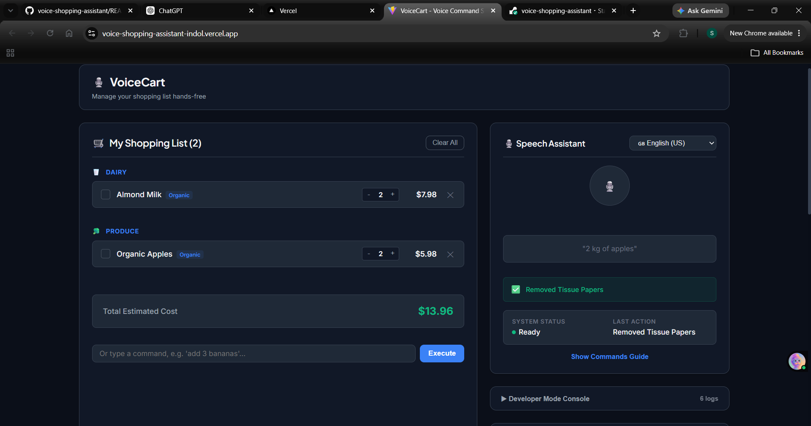
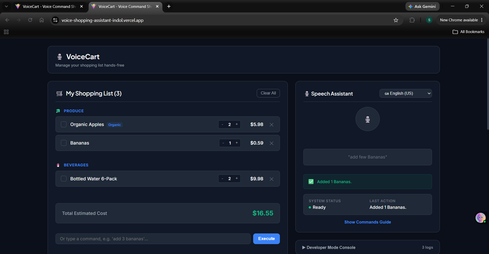
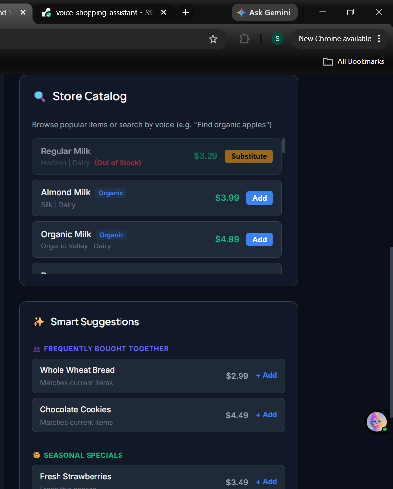

# VoiceCart - Voice Command Shopping Assistant

## Live Demo

Application: https://voice-shopping-assistant-indol.vercel.app/

GitHub Repository: https://github.com/SakshiMore2312/voice-shopping-assistant

---

## Overview

VoiceCart is a React-based web application that enables users to manage their shopping list using natural voice commands. The application leverages the browser's Web Speech API for speech recognition and the SpeechSynthesis API for voice feedback, providing a hands-free shopping experience.

The project demonstrates frontend engineering concepts such as custom React hooks, natural language command parsing, state management, performance optimization, accessibility, and modular application architecture.

---

## Features

### Voice Commands

- Add products using voice
- Remove products from the shopping list
- Update product quantities
- Clear the shopping list
- Search products using voice

### Natural Language Processing

- Intent detection
- Quantity extraction
- Singular and plural normalization
- Typo-tolerant product matching
- Filtering of unrelated speech
- Category-based search
- Price-based filtering

### Shopping List Management

- Duplicate item detection
- Automatic quantity updates
- Category-wise organization
- Estimated total cost calculation
- Local storage persistence
- Support for custom items

### Recommendation Engine

- Frequently bought together suggestions
- Seasonal recommendations
- Recently purchased recommendations

### Accessibility

- Keyboard navigation
- ARIA labels
- Focus indicators
- Live announcements
- Reduced motion support

### Error Handling

- React Error Boundary
- Browser compatibility checks
- Microphone permission handling
- Speech recognition timeout handling
- Toast notifications

---

## Technology Stack

### Frontend

- React
- Vite
- JavaScript (ES6+)
- CSS

### Browser APIs

- Web Speech API
- SpeechSynthesis API
- Local Storage API

### React Concepts

- Functional Components
- Custom Hooks
- useState
- useEffect
- useMemo
- useCallback
- React.memo

---

## Project Structure

```
voice-shopping-assistant/
│
├── public/
│
├── src/
│   ├── components/
│   ├── hooks/
│   ├── utils/
│   ├── data/
│   ├── styles/
│   ├── App.jsx
│   └── main.jsx
│
├── package.json
├── vite.config.js
├── index.html
└── README.md
```

---

## Supported Voice Commands

### Add Products

```
Add milk
Buy  apples
Add organic eggs
```

### Remove Products

```
Remove milk
Delete bananas
Remove bread
```

### Update Quantity

```
Increase milk quantity to 5
Reduce apples to 2
Set bread quantity to 4
```

### Search Products

```
Find dairy products
Find organic apples
Search snacks
Find toothpaste under 5 dollars
```

### Clear Shopping List

```
Clear my shopping list
Clear everything
```

---

## Application Workflow

1. User speaks a command.
2. Speech Recognition converts voice into text.
3. The NLP parser extracts the user's intent.
4. Product matching identifies the requested item.
5. Shopping list state is updated.
6. Recommendations are generated.
7. Voice feedback confirms the action.
8. Data is stored in Local Storage.

---

## Performance Optimizations

- Memoized React components using React.memo
- useMemo for expensive computations
- useCallback for event handlers
- Optimized rendering
- Cleanup of speech recognition listeners
- Efficient state updates

---

## Screenshots

### Home Screen



### Voice Recognition



### Shopping List


## Browser Compatibility

Recommended browsers:

- Google Chrome
- Microsoft Edge

Speech Recognition support depends on browser implementation of the Web Speech API.

---

## Installation

### Clone Repository

```bash
git clone https://github.com/SakshiMore2312/voice-shopping-assistant.git
```

### Navigate to Project

```bash
cd voice-shopping-assistant
```

### Install Dependencies

```bash
npm install
```

### Run Development Server

```bash
npm run dev
```

### Build Production Version

```bash
npm run build
```

### Preview Production Build

```bash
npm run preview
```

---

## Design Decisions

The application follows a modular architecture by separating speech recognition, natural language processing, recommendation logic, and user interface components into independent modules. This improves maintainability and simplifies future feature additions.

Browser-native APIs are used instead of external speech services, reducing project complexity and eliminating third-party dependencies for speech functionality.

React performance optimizations such as memoization and callback caching are used to minimize unnecessary re-renders during continuous speech recognition.

---

## Limitations

- Speech Recognition support varies across browsers.
- Recognition accuracy depends on microphone quality and background noise.
- Voice recognition language availability depends on browser support.
- Some browsers require an internet connection for speech recognition.

---

## Future Improvements

- Multi-language NLP support
- User authentication
- Cloud synchronization
- Shopping history analytics
- Progressive Web App (PWA)
- Barcode scanning
- AI-powered personalized recommendations

---

## Deployment

Frontend (Vercel)

https://voice-shopping-assistant-indol.vercel.app/

Repository

https://github.com/SakshiMore2312/voice-shopping-assistant

---

## License

This project was developed for educational purposes as part of a campus hiring assignment.
